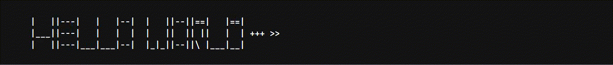

    
  
  
    

   
   
  
  

## 🛠️ Tools i use

    
    
    
    
    
    
    
    
    
    
    
    
    
    
    
    
    
    
    
    
    
    
    

## 🔥 Streak stats

  

## 📊 Github stats

  
  
   

